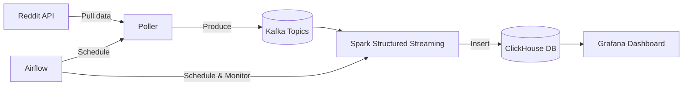

# Reddit Realtime Pipeline 🚀

Một hệ thống **real-time data pipeline** thu thập và phân tích dữ liệu từ **Reddit**, sử dụng các công cụ Big Data hiện đại như **Kafka → Spark → ClickHouse → Grafana**.  
Dự án này nhằm mục tiêu **thực hành kỹ năng Data Engineering** và xây dựng **dashboard realtime** hiển thị thống kê từ Reddit.

---

## 📂 Cấu trúc thư mục

```
reddit-realtime-pipeline/
├── airflow/        # DAGs & workflow orchestration
├── clickhouse/     # Cấu hình ClickHouse database
├── docs/           # Tài liệu dự án (sơ đồ kiến trúc, mô tả)
├── grafana/        # Dashboard cấu hình
├── kafka/          # Kafka broker & topics setup
├── poller/         # Poller để thu thập dữ liệu từ Reddit API
├── spark/          # Spark streaming jobs (Kafka → ClickHouse)
├── .venv/          # Virtual environment (ignored by git)
├── .gitignore
├── .dockerignore
├── docker-compose.yml
├── requirements.txt
└── README.md
```

---

## 🏗️ Kiến trúc hệ thống



---

## ⚡ Công nghệ sử dụng

- [Apache Kafka](https://kafka.apache.org/) – Message broker cho luồng dữ liệu.
- [Apache Spark](https://spark.apache.org/) – Xử lý streaming & batch, ETL.
- [ClickHouse](https://clickhouse.com/) – OLAP database tối ưu cho analytics.
- [Grafana](https://grafana.com/) – Dashboard trực quan hóa dữ liệu.
- [Apache Airflow](https://airflow.apache.org/) – Orchestrator cho workflow.
- [Docker Compose](https://docs.docker.com/compose/) – Triển khai nhanh toàn bộ stack.

---

## 🔧 Cách chạy

### 1. Clone repo
```bash
git clone https://github.com/<your-username>/reddit-realtime-pipeline.git
cd reddit-realtime-pipeline
```

### 2. Khởi tạo môi trường
```bash
python -m venv .venv
source .venv/bin/activate   # Linux/Mac
.venv\Scripts\activate      # Windows

pip install -r requirements.txt
```

### 3. Khởi động stack
```bash
docker-compose up -d
```

### 4. Truy cập các service
- **Airflow**: [http://localhost:8080](http://localhost:8080)  
- **Grafana**: [http://localhost:3000](http://localhost:3000)  
- **ClickHouse UI**: [http://localhost:8123](http://localhost:8123)  

---

## 📊 Dashboard mẫu

> _Ví dụ: biểu đồ số lượng bài viết & bình luận theo subreddit trong thời gian thực._  
(Ở đây bạn có thể thêm hình chụp màn hình Grafana dashboard của bạn sau khi chạy xong.)

---

## 📌 Roadmap

- [x] Thiết lập Kafka + Spark streaming job.  
- [x] Lưu dữ liệu Reddit vào ClickHouse.  
- [ ] Thiết kế Airflow DAGs để tự động hoá pipeline.  
- [ ] Hoàn thiện Grafana dashboard với alerting.  
- [ ] Viết test cho poller + pipeline.  

---

## 📜 License
Dự án này được phát hành dưới [MIT License](LICENSE).


